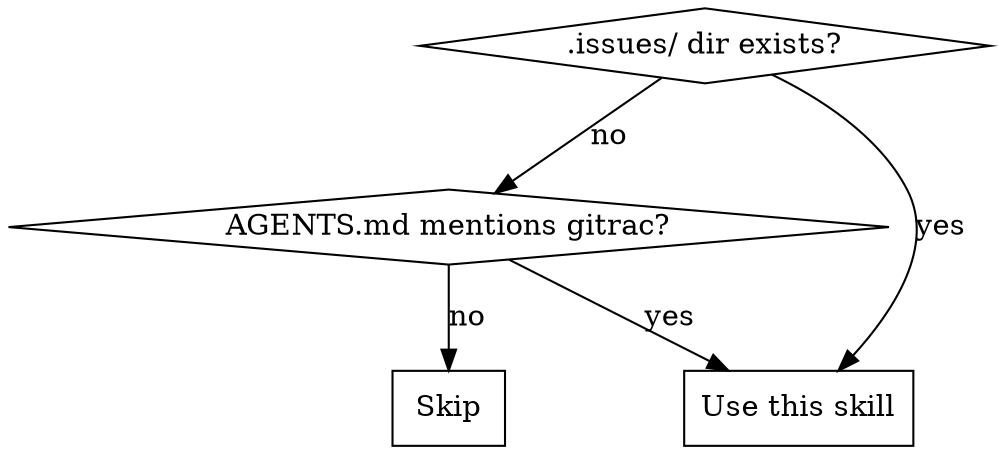

# Using gitrac

## Overview

gitrac manages project issues as markdown files in the git repo itself. Issues live in `.issues/`, closed issues in `.issues/closed/`. Every mutation auto-commits to git.

**Core principle:** Claim before working. Close in the same commit as the code change.

## When to Use



- Project has a `.issues/` directory at the repo root
- AGENTS.md or CLAUDE.md references gitrac
- You've been asked to work on a gitrac issue

## Installation

**From GitHub releases (standalone binary):**
```bash
# Download for your platform from https://github.com/murrayju/gitrac/releases
# Place the binary on your PATH
gitrac --help
```

**From source (if working in the gitrac repo itself):**
```bash
./bun index.ts <command>
```

When installed as a binary, replace `./bun index.ts` with `gitrac` in all examples below.

## Quick Reference

| Command | Description |
|---------|------------|
| `gitrac ls` | List open issues |
| `gitrac show <id>` | View issue details |
| `gitrac create -t "title"` | Create an issue |
| `gitrac claim <id>` | Assign to yourself + set in_progress |
| `gitrac close <id>` | Close an issue (moves to closed/) |
| `gitrac close <id> --no-commit` | Close without committing (for atomic commits) |
| `gitrac close <id> -c "text"` | Close with an inline comment |
| `gitrac comment <id> "text"` | Add a comment |
| `gitrac edit <id> -s todo` | Update status |
| `gitrac ls -o json` | Machine-readable output |

## The Workflow

### 1. Find work

```bash
gitrac ls
```

Review the open issues. Pick one that matches the task at hand.

### 2. Claim it

```bash
gitrac claim <id>
```

This sets `assignee` to your git user and `status` to `in_progress`, and commits the change. Other agents will see the issue is taken.

### 3. Implement the fix/feature

Write code, run tests — the normal development workflow. The issue file in `.issues/` serves as your spec.

### 4. Document what was done

**Always add a comment before closing.** The comment should read like a PR description. You can either use the standalone comment command or the `--comment` / `-c` flag on close:

```bash
# Standalone comment
gitrac comment <id> "Summary of changes: what was fixed/added, why, files affected, and any notable decisions."

# Or inline with close (preferred for atomic workflows)
gitrac close <id> --no-commit --comment "Summary of changes"
```

The comment becomes part of the issue's permanent history. Write it for someone who needs to understand what happened without reading every diff line.

The `--comment` / `-c` flag is also available on `claim`, `edit`, and `reopen`.

### 5. Close with the code change

This is the key pattern. Close the issue **in the same commit** as the code change:

```bash
# Close the issue with a comment, without auto-committing
gitrac close <id> --no-commit -c "Summary of what was done"

# Stage everything together: code changes + the closed issue file
git add -A

# One atomic commit
git commit -m "fix: resolve the problem (#<id>)"
```

This creates a single commit that contains both the code fix and the issue state change. Anyone looking at the commit sees exactly what was fixed and why.

### 6. Verify

```bash
gitrac ls              # issue should no longer appear
gitrac show <id>       # should show status: done, in .issues/closed/
```

## Reading Issues Directly

Issues are plain markdown. You can read them without the CLI:

```
.issues/<id>-<slug>.md     # open issues
.issues/closed/<id>-<slug>.md  # closed issues
```

Format: YAML frontmatter (id, title, status, priority, assignee, labels, dates) followed by a markdown description, then optionally a `---` separator and comments. Each comment starts with `### author — timestamp`.

When reading comment bodies, headings are escaped (`\## Heading` means `## Heading`).

## Structured Output for Agents

Use `-o json` or `-o yaml` for machine-readable output:

```bash
gitrac ls -o json                    # all open issues as JSON array
gitrac show <id> -o json             # single issue as JSON
gitrac ls -o json --status all       # include closed issues
```

This is useful for programmatic decision-making about which issue to work on.

## Common Mistakes

| Mistake | Why it's wrong | Fix |
|---------|---------------|-----|
| Closing in a separate commit | Breaks the atomic link between fix and issue | Use `--no-commit` on close, commit together |
| Not claiming before working | Another agent may start the same work | Always `claim` first |
| Editing issue files directly | Bypasses git auto-commit, may produce invalid format | Use the CLI |
| Forgetting `--no-commit` on close | Creates two commits instead of one | Close with `--no-commit`, then `git add -A && git commit` |
| Working on closed issues | They live in `closed/` and are done | Check `gitrac show <id>` first |
| Closing without a comment | Loses context about what was done and why | Always `gitrac comment <id> "..."` before closing |

## Creating Issues

When you discover a bug or identify needed work during development:

```bash
gitrac create -t "Brief description" -p high -l bug
```

Flags: `-t` title (required), `-p` priority, `-l` labels (comma-separated), `-a` assignee, `-s` status.

Don't over-describe in the title — the issue file supports a full markdown description that you can edit later via the web UI or directly.
